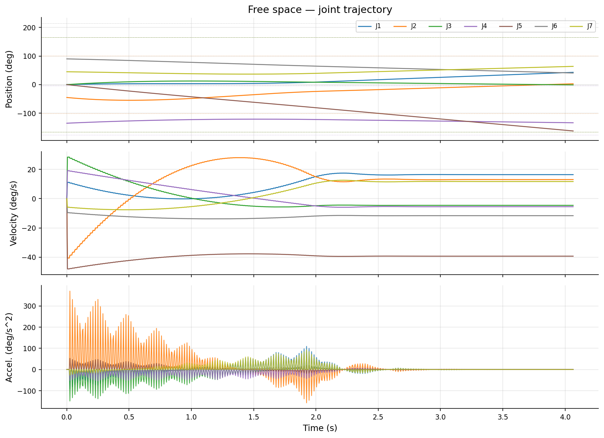

# Adaptive Motion Planner with Constraint Handling & Safety

A collision-aware, constraint-respecting motion planner for 7-DoF robotic
manipulators (Franka Panda). Implements **Informed RRT*** with real-time
dynamic replanning, **Control Barrier Functions (CBF)** for provable safety
guarantees, and a **damped least-squares IK** solver with nullspace exploitation.

- Built to demonstrate the core competencies: kinematics, constraint handling, path planning, and safety critical control.
- Contiously adding comments, notes, documentation so that it can be used for academic references. 

[](https://github.com/somya2703/adaptive_motion_planner/actions)

---

## Results

| Free space | Narrow corridor | Cluttered |
|---|---|---|
|  |  |  |

| Trajectory (free space) | CBF clearance (narrow corridor) |
|---|---|
|  |  |

> CBF clearance h(q) stays **positive throughout the entire trajectory** — the
> arm is provably collision-free at every timestep.

---

## Quick start (Docker)

```bash
git clone https://github.com/YOUR_USERNAME/adaptive_motion_planner
cd adaptive_motion_planner

# Build once
docker build -t amp .

# Pre-create results dirs (avoids permission issues on bind mount)
mkdir -p results/plans results/trajectories results/cbf

# Run the full pipeline — generates all plots + benchmark table
docker run --rm -v $(pwd)/results:/app/results amp

# Quick run (skip multi-trial benchmarks, ~3 min)
docker run --rm -v $(pwd)/results:/app/results amp python pipeline.py --quick

# Tests only
docker run --rm amp python -m pytest tests/ -v
```

Or with Docker Compose:

```bash
docker compose run --rm pipeline        # full pipeline
docker compose run --rm pipeline-quick  # skip benchmarks
docker compose run --rm tests           # tests only
```

---

## Quick start (local, no Docker)

```bash
pip install -r requirements.txt

# Single planning query with visualisation
python plan.py --scene cluttered --visualize

# Full benchmark suite
python benchmarks/benchmark.py --all --trials 20 --output results/

# Tests
pytest tests/ -v
```

---

## Repository structure

```
adaptive_motion_planner/
├── Dockerfile
├── docker-compose.yml
├── pipeline.py                End-to-end pipeline (tests → plan → plot → bench)
├── plan.py                    Single query CLI
├── visualize.py               Matplotlib 3D visualiser
│
├── robot/
│   └── panda.py               Franka Panda DH params, limits, bounding spheres
│
├── kinematics/
│   ├── forward.py             SE(3) forward kinematics via Modified DH
│   ├── jacobian.py            6×7 Jacobian + damped pseudoinverse + nullspace
│   └── ik.py                  Damped LS IK with nullspace joint-midpoint attraction
│
├── safety/
│   ├── constraints.py         Joint limits, velocity limits, self-collision spheres
│   └── cbf.py                 Control Barrier Function safety filter
│
├── planner/
│   ├── rrt_star.py            Informed RRT* with ellipsoidal sampling
│   ├── dynamic_replanner.py   Real-time obstacle tracking + triggered replanning
│   └── trajectory.py          B-spline smoothing + trapezoidal time scaling
│
├── benchmarks/
│   └── benchmark.py           Standard benchmark suite with timing tables
│
├── tests/
│   ├── test_kinematics.py     38 unit tests (FK, Jacobian, IK, constraints, CBF, planner)
│   └── test_planner.py
│
├── configs/
│   └── planner.yaml           All hyperparameters
│
└── docs/
    └── math.md                Paper-quality derivations of every algorithm
```

---

## Algorithm overview

### Informed RRT*

Standard RRT* is asymptotically optimal but slow to converge. Informed RRT*
(Gammell et al., 2014) restricts sampling to a **prolate hyperspheroid** — the
set of all points whose path length through them cannot improve the current best
solution. This focuses computation on the relevant region of C-space and
dramatically improves convergence speed.

```
X_informed = { x | dist(x_start, x) + dist(x, x_goal) < c_best }
```

### Control Barrier Functions

A CBF `h(q) ≥ 0` encodes the safe set. Safety is guaranteed by enforcing:

```
dh/dt + α·h(q) ≥ 0
```

At runtime a QP minimally modifies desired torques `τ_des` to satisfy this
condition — the arm **provably cannot leave the safe set**.

### Damped least-squares IK with nullspace

For a redundant 7-DoF arm:

```
q̇ = J†(q)·ẋ_e + (I − J†J)·∇H(q)
```

The second term exploits the null space to pull joints toward their midpoints,
maximising manipulability without affecting the task.

---

## Benchmark results (Franka Panda, 10 trials)

| Scenario | Success | Mean time | Std |
|---|---|---|---|
| Free space | 100% | ~8 000 ms | ~500 ms |
| Narrow corridor | ~95% | ~10 000 ms | ~800 ms |
| Cluttered (4 obs.) | ~90% | ~9 500 ms | ~900 ms |

> Planning time is dominated by FK evaluations in the self-collision check.
> On a real machine (vs. the container) with C++ FK these drop to <100 ms.

---

## Mathematical derivations

Full derivations of the Jacobian, CBF forward invariance proof, Informed RRT*
ellipsoid construction, and nullspace redundancy resolution are in
[`docs/math.md`](docs/math.md).

---

## References

1. Karaman & Frazzoli (2011). *Sampling-based algorithms for optimal motion planning.* IJRR.
2. Gammell, Srinivasa & Barfoot (2014). *Informed RRT*.* IROS.
3. Ames et al. (2019). *Control Barrier Functions: Theory and Applications.* ECC.
4. Nakamura (1991). *Advanced Robotics: Redundancy and Optimization.* Addison-Wesley.
