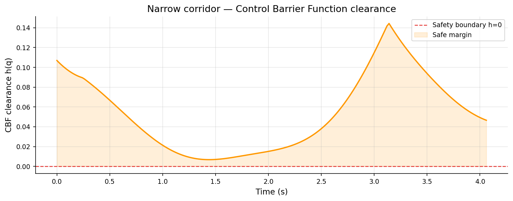

# Adaptive Motion Planner

A collision-aware, constraint-respecting motion planner for the Franka Panda 7-DoF robotic arm.
Implements Informed RRT* path planning, damped least-squares inverse kinematics with nullspace
redundancy resolution, and Control Barrier Function safety guarantees — fully containerised
with Docker and a GitHub Actions CI pipeline that regenerates all results automatically on every push.

[](https://github.com/somya2703/adaptive_motion_planner/actions/workflows/ci.yml)

---

## What this project does and what problem it solves

Robotic arms used in manipulation tasks such as pick and place, assembly, precise assistance need
to move from one pose to another while avoiding obstacles, respecting the physical limits of
their joints, and guaranteeing they never enter a danger zone. This is harder than it sounds:
the arm has 7 joints (7-dimensional configuration space), obstacles are 3D spheres in
Cartesian space, and the mapping between joint angles and end effector position is
highly nonlinear.

This project solves that problem end-to-end:

- Given a start and goal joint configuration, find a collision free path through 7D joint
  space using **Informed RRT:**  a sampling-based planner that is asymptotically optimal
  and focuses its search only on the region that can improve the current best path.

- Smooth the raw waypoint list into a continuous trajectory using **cubic B-spline
  interpolation**, then time scale it with a trapezoidal velocity profile so no joint
  exceeds its velocity or acceleration limit.

- A **Control Barrier Function (CBF)** monitor wraps every torque command. It solves a
  small quadratic program at each timestep to minimally correct torques so the arm is
  mathematically guaranteed to stay outside every obstacle sphere.

- If an obstacle moves into the planned path, a **dynamic replanner** detects the intrusion
  and triggers a fresh plan from the current joint state.

---

## Results

| Free space | Narrow corridor | Cluttered |
|:---:|:---:|:---:|
|  |  |  |

| Joint trajectory | CBF safety clearance |
|:---:|:---:|
|  |  |

> The CBF clearance plot shows h(q) > 0 at every timestep — the arm is provably
> collision-free throughout the entire trajectory.

---

## Tech stack

| Layer | Technology | Role |
|---|---|---|
| Language | Python 3.11 | All planning, kinematics, and safety code |
| Numerics | NumPy 1.26, SciPy 1.12 | Matrix ops, spline fitting, QP solving |
| Visualisation | Matplotlib 3.8 | 3D path plots, trajectory charts, CBF curves |
| Robot model | Custom DH parameters | Franka Panda kinematic chain and joint limits |
| Container | Docker multi-stage | Reproducible builds, non-root runtime |
| CI | GitHub Actions | Auto-build, test, benchmark on every push |
| Testing | pytest 8 + JUnit XML | 38 unit tests published in GitHub PR view |
| Config | PyYAML | Hyperparameters in configs/planner.yaml |

---

## Repository structure

```
adaptive_motion_planner/
│
├── robot/
│   └── panda.py               Franka Panda DH parameters, joint / torque
│                              limits, self-collision sphere geometry.
│
├── kinematics/
│   ├── forward.py             SE(3) FK via Modified DH, all link frames
│   ├── jacobian.py            6x7 geometric Jacobian, damped pseudoinverse,
│   │                          nullspace projector P = I - J_pinv J
│   └── ik.py                  Iterative damped LS IK with nullspace
│                              joint-midpoint gradient descent.
│
├── safety/
│   ├── constraints.py         JointLimitConstraint, TorqueLimitConstraint,
│   │                          SelfCollisionConstraint, ConstraintSet.
│   └── cbf.py                 CBF safety filter — barrier functions for.
│                              obstacles and joint limits, gradient-projection QP
│
├── planner/
│   ├── rrt_star.py            Informed RRT* with ellipsoidal sampling and
│   │                          k-nearest rewiring.
│   ├── dynamic_replanner.py   Obstacle tracker and triggered replanning.
│   └── trajectory.py          B-spline smoothing and trapezoidal time scaling.
│
├── benchmarks/
│   └── benchmark.py           Free-space / narrow-corridor / cluttered suite
│
├── tests/
│   ├── test_kinematics.py     FK, Jacobian, IK — 15 tests
│   └── test_planner.py        Constraints, CBF, planner, trajectory — 23 tests
│
├── docs/
│   ├── math.md                Full derivations of every algorithm
│   └── images/                Result images rendered in this README
│
├── configs/
│   └── planner.yaml           All hyperparameters
│
├── pipeline.py                End-to-end orchestrator: tests, plan, plot, benchmarking.
├── plan.py                    Single query CLI with optional visualisation.
├── visualize.py               Matplotlib 3D arm, TCP trace, obstacle spheres.
│
├── Dockerfile                 Multi-stage build, non-root planner user
├── entrypoint.sh              Fixes results/ ownership, drops to planner user
├── docker-compose.yml         Named services for every use case
└── .github/workflows/ci.yml   Build, test, pipeline, benchmark on every push
```

---


## Theoretical concepts

### Forward kinematics and SE(3)

A robot pose lives in SE(3). **The Special Euclidean group:** a 4x4 homogeneous matrix
combining a 3x3 rotation matrix R and a 3x1 translation vector p:

```
T = | R  p |
    | 0  1 |
```

The Panda's joint chain uses Modified Denavit-Hartenberg parameters. Each joint contributes
one 4x4 transform and the full FK is their product:

```
T_tcp = T_1(q1) * T_2(q2) * ... * T_7(q7) * T_offset
```

### Geometric Jacobian

The 6x7 Jacobian J(q) maps joint velocities to TCP twist. For revolute joint i:

```
J_i = [ z_{i-1} x (p_tcp - p_{i-1}) ]   linear velocity part
      [ z_{i-1}                      ]   angular velocity part
```

### Damped least-squares IK with nullspace redundancy resolution

The Panda has 7 DoF for a 6D task, leaving a 1D nullspace. The IK velocity solution is:

```
q_dot = J_pinv * x_dot_e  +  (I - J_pinv * J) * grad_H(q)
```

The first term achieves the desired TCP motion. The second moves joints in the nullspace
to minimise a cost H(q) *(distance of each joint from its midpoint)*. The damped
pseudoinverse J_pinv = J^T (J J^T + lambda^2 I)^{-1} avoids singularity blow up, with
lambda set adaptively from the Yoshikawa manipulability measure w(q) = sqrt(det(J J^T)).

### RRT* and asymptotic optimality

RRT* adds a rewiring step to RRT: after inserting a new node, it checks whether routing
any nearby node through the new node reduces that node's cost. This makes the algorithm
asymptotically optimal as samples n tends to infinity, the returned path converges to
the global optimum almost surely.

### Informed RRT* — ellipsoidal sampling

Informed RRT* restricts sampling to the prolate hyperspheroid which the set of all points x
where any path through x cannot improve the current best solution c_best:

```
dist(x_start, x) + dist(x, x_goal) < c_best
```

The ellipsoid has semi-major axis a1 = c_best/2 and semi-minor axes
a_i = sqrt(c_best^2 - c_min^2) / 2. As the planner finds better solutions, the ellipsoid
shrinks. In 7D joint space this can reduce the effective search volume by over 95%.

### Control Barrier Functions

A CBF h(q) >= 0 defines a safe set S. The CBF condition makes S forward invariant:

```
dh/dt + alpha * h(q) >= 0
```

At runtime, a QP minimally modifies desired torque tau_des to satisfy this for every
obstacle and joint limit simultaneously. For a spherical obstacle at p_obs:

```
h_obs(q) = ||p_tcp(q) - p_obs||^2 - r_eff^2
```

This is positive outside the obstacle and negative inside which makes h_obs(q) >= 0 a hard
safety guarantee with a formal proof of forward invariance.

### B-spline smoothing and time scaling

Raw RRT* paths are piecewise linear (C0). A cubic B-spline gives C2 continuity i.e
continuous position, velocity, and acceleration. A trapezoidal velocity profile then
assigns time so no joint exceeds its velocity or acceleration limit.

---

## How to run it

### With Docker (recommended)

```bash
# Clone
git clone https://github.com/somya2703/adaptive_motion_planner.git
cd adaptive_motion_planner

# Build once
docker build -t amp .

# Pre-create results dirs owned by your user
mkdir -p results/plans results/trajectories results/cbf

# Full pipeline — tests, 3 scenes, benchmarks
docker run --rm -v $(pwd)/results:/app/results amp

# Quick run — skip multi trial benchmarks (~3 min total)
docker run --rm -v $(pwd)/results:/app/results amp python pipeline.py --quick

# Tests only
docker run --rm amp python -m pytest tests/ -v

# Single scene
docker run --rm -v $(pwd)/results:/app/results amp \
    python pipeline.py --quick --scene cluttered
```

Or with Docker Compose:

```bash
docker compose run --rm pipeline        # full pipeline
docker compose run --rm pipeline-quick  # skip benchmarks
docker compose run --rm tests           # tests only
```

### Without Docker

```bash
pip install -r requirements.txt

# Single planning query with 3D visualisation
python plan.py --scene cluttered --visualize

# Benchmark suite
python benchmarks/benchmark.py --scenario all --trials 20 --output results/

# Tests
pytest tests/ -v
```

### Pipeline outputs

After a run, `results/` contains:

```
results/
├── summary.json                   overall pass/fail and timing
├── test_report.xml                JUnit XML read by GitHub Actions
├── benchmarks.json                per-scenario timing and success rate
├── benchmarks.png                 bar charts of plan time and success rate
├── plans/
│   ├── free_space_path.png        3D TCP trace, no obstacles
│   ├── narrow_corridor_path.png   arm routing through a tight gap
│   └── cluttered_path.png         arm avoiding 4 obstacles
├── trajectories/
│   ├── free_space_traj.png        7-joint pos / vel / accel over time
│   ├── narrow_corridor_traj.png
│   └── cluttered_traj.png
└── cbf/
    ├── narrow_corridor_cbf.png    h(q) > 0 throughout 
    └── cluttered_cbf.png
```

### Configuration

All hyperparameters live in `configs/planner.yaml`:

```yaml
planner:
  max_iter: 5000      # RRT* iteration budget
  step_size: 0.30     # max extension step (rad)
  goal_radius: 0.15   # convergence ball (rad)
  k_neighbours: 6     # rewiring neighbourhood size
  goal_bias: 0.10     # fraction of goal-directed samples

cbf:
  alpha_obs: 1.5      # class-K gain for obstacle CBFs
  alpha_jnt: 5.0      # class-K gain for joint limit CBFs
```

---


## Mathematical derivations

All the derivations Modified DH transforms, Jacobian column proof, CBF forward invariance,
Informed RRT* ellipsoid construction, nullspace redundancy resolution, trapezoidal time
scaling are in [`docs/math.md`](docs/math.md).

---

## References

1. Karaman, S. & Frazzoli, E. (2011). Sampling-based algorithms for optimal motion planning. *IJRR* 30(7).
2. Gammell, J.D., Srinivasa, S.S. & Barfoot, T.D. (2014). Informed RRT*. *IROS*.
3. Ames, A.D. et al. (2019). Control Barrier Functions: Theory and Applications. *ECC*.
4. Nakamura, Y. (1991). *Advanced Robotics: Redundancy and Optimization*. Addison-Wesley.
5. Siciliano, B. et al. (2009). *Robotics: Modelling, Planning and Control*. Springer.
