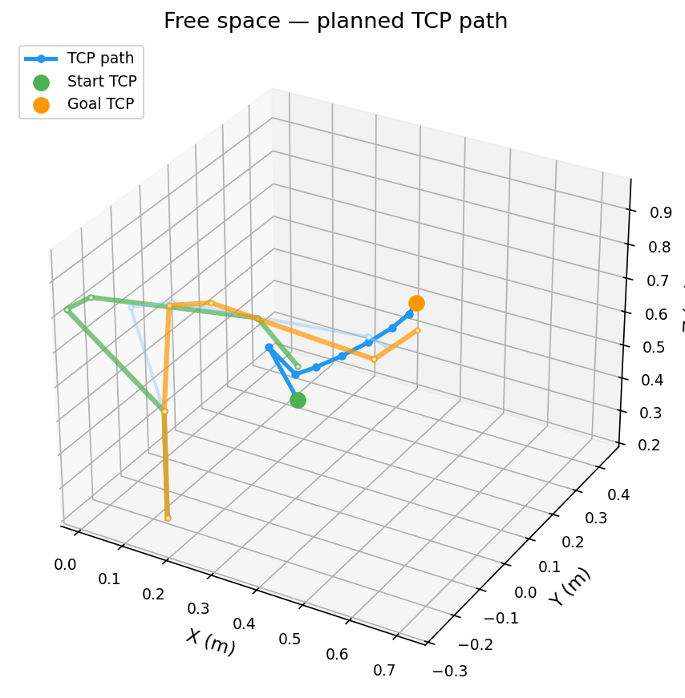
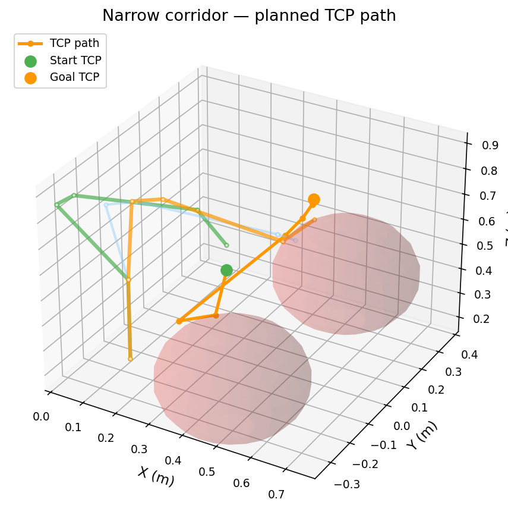
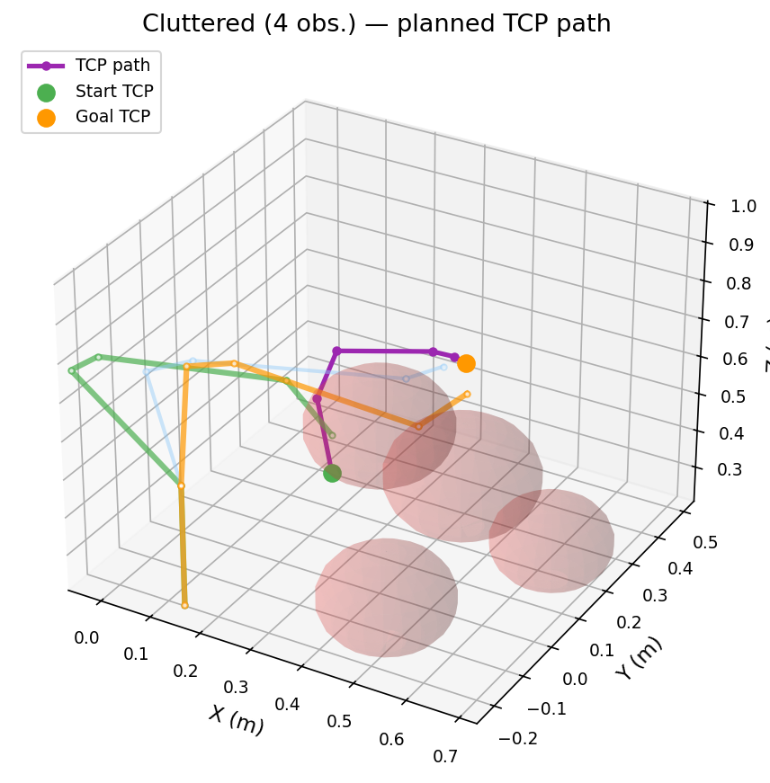
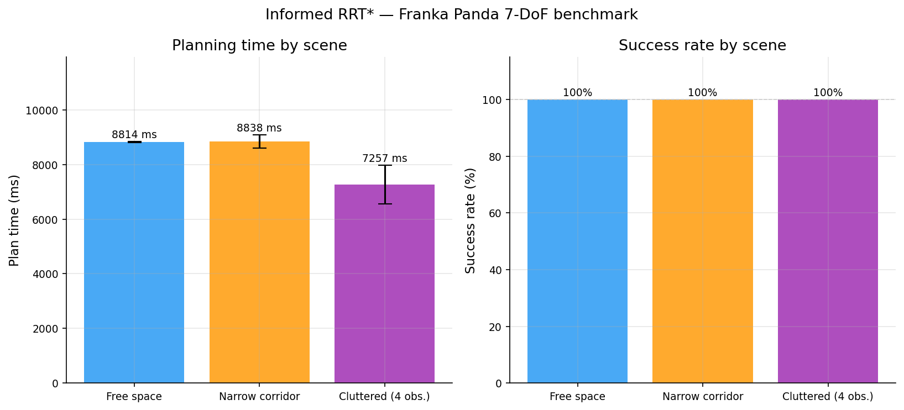
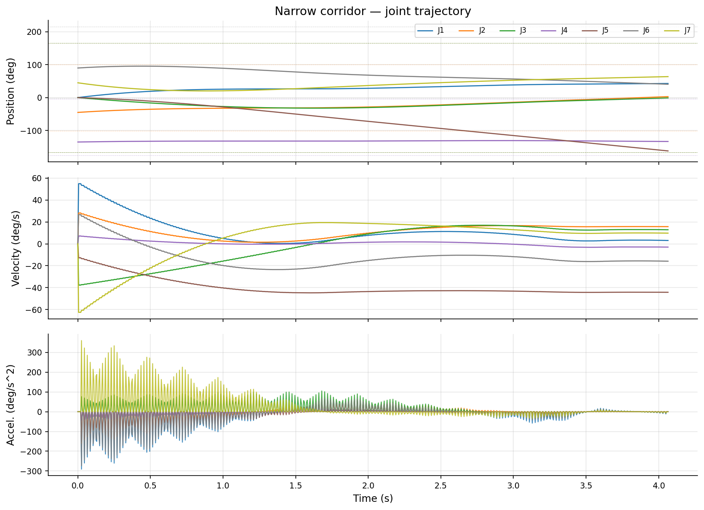
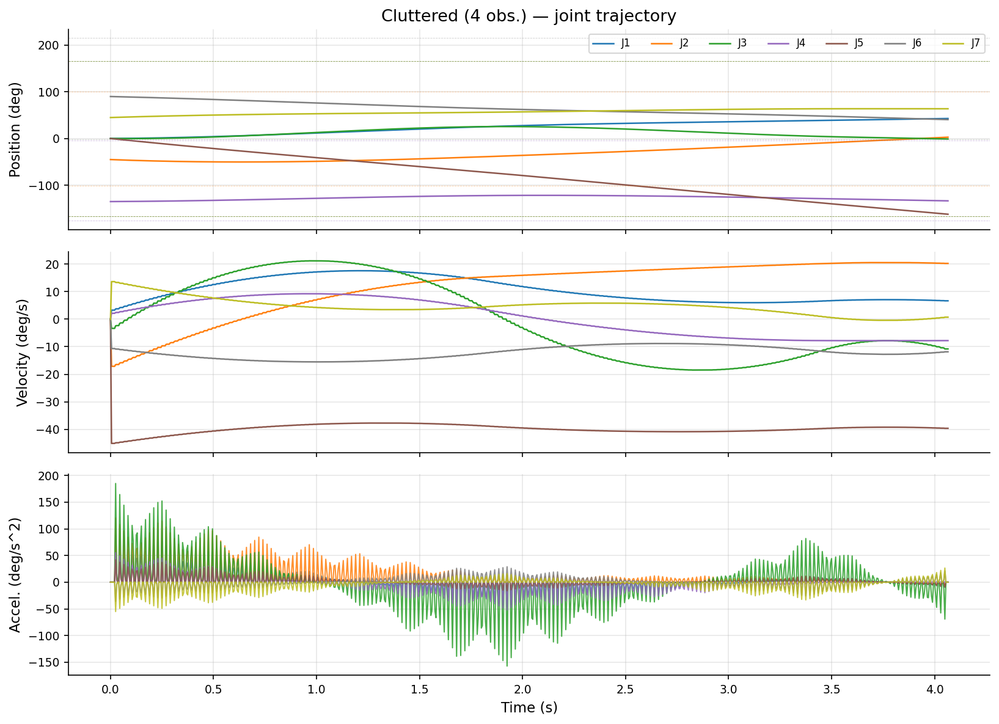
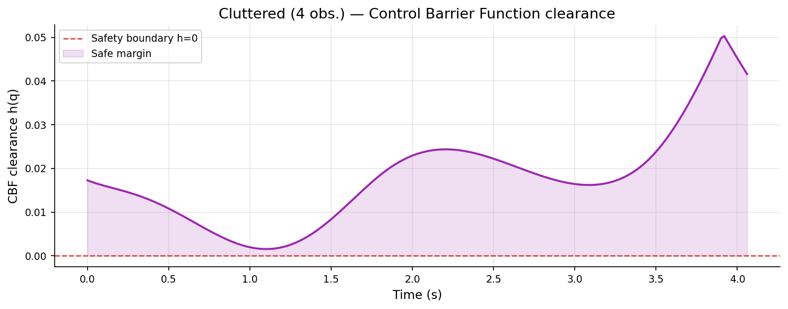

# Pipeline results

Generated by `pipeline.py` · 2026-04-10 03:10 UTC

## Test suite

| Status | Time |
|--------|------|
| PASSED | 34.7 s |

## Benchmark results

| Scene | Success | Mean time | Std | Path length |
|-------|---------|-----------|-----|-------------|
| Free space | 100% | 8814 ms | +/-19 ms | 3.377 rad |
| Narrow corridor | 100% | 8838 ms | +/-244 ms | 3.382 rad |
| Cluttered (4 obs.) | 100% | 7257 ms | +/-710 ms | 3.575 rad |

## Visualisations

### Planned paths

| Free space | Narrow corridor | Cluttered |
|---|---|---|
|  |  |  |

### Benchmark chart

### Trajectories

| Free space | Narrow corridor | Cluttered |
|---|---|---|
|  |  |  |

### CBF safety margin

| Narrow corridor | Cluttered |
|---|---|
|  |  |
